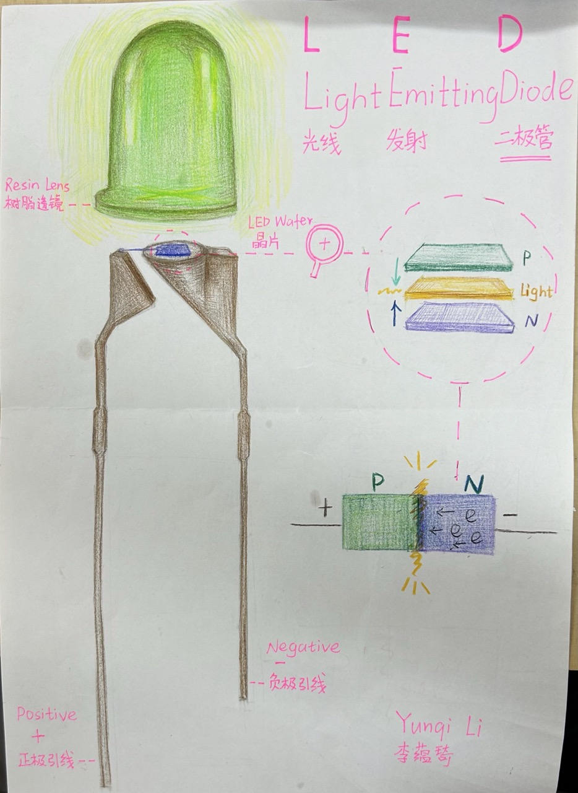

# Sketch - LED

## Description
We sketched some basic components to understand the structures of them and how they work. I sketched LED!
   
There is a list of the components that you can choose and sketch: 
1. Resistor
2. Ceramic capacitor (tiny one)
3. Electrolytic capacitor big black one)
4. LED diode
5. Voltage Regulator (Transistor)
6. Crystal Oscillator
7. Microcontroller (ATMega328p)
8. Pin Headers and Jumper Wires
   
## Documentation

	

