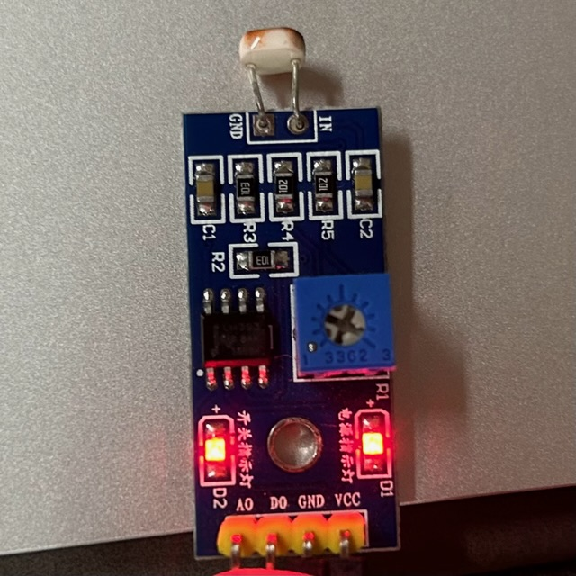
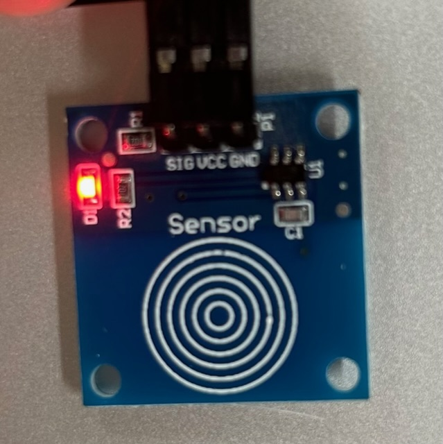
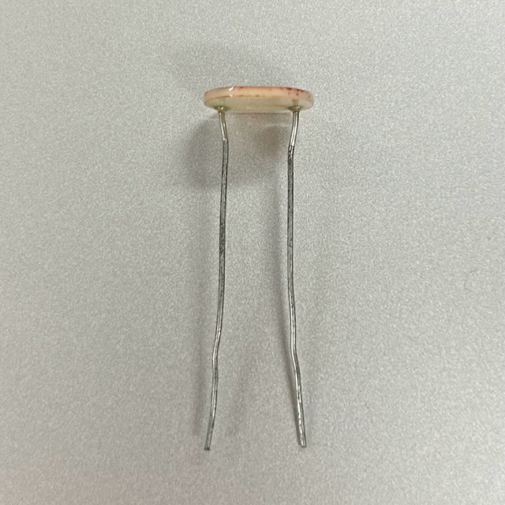
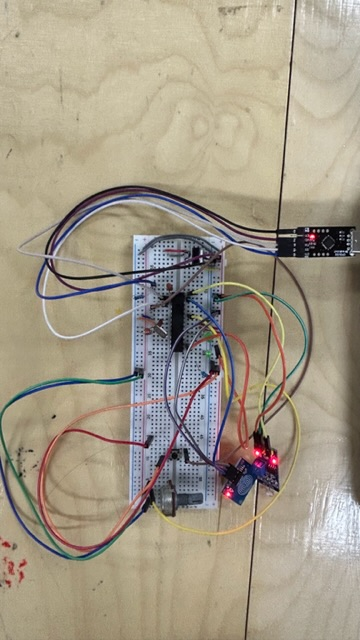

# Sensors Tryout

## Assignment's description
In this experiment, we're diving into Arduino's input devices. I picked a light sensor and a touch sensor to deal with both analog and digital signals.

- Sensors usually have three pins: VCC, GND, and SIG, which connect to power, ground, and Arduino pins seperately.
  - 
- If you're using a two-pin sensor, hook one pin up to power and the other to an Arduino pin.**And don't forget to link a ground wire to that same Arduino pin's side.**
  - 

## Documentation
At first, I plugged the touch sensor into pin 4. But, surprise, the touch sensor readings stayed the same. I checked the Arduino docs and found out that pin 4 is for analog input. So, I moved the touch sensor to pin 12, a digital input pin, and it worked! But then, I dug deeper and learned that analog pins can also handle digital signals. So, I tried the touch sensor again on an analog pin, and this time it worked. That initial problem was probably a hardware connection problem.

Remember, on the Arduino board, there are two kinds of interfaces to keep in mind: digital and analog.For beginners, you'd better to use digital pins for handling digital signals (input and output) and analog pins for dealing with analog signals (input and output). This approach simplifies things and helps you get started more smoothly.

