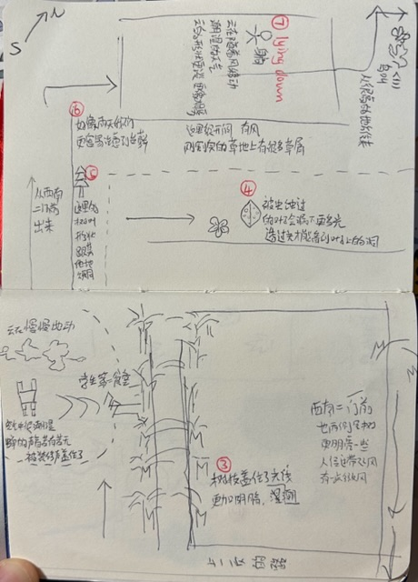

# 🔍Exploration

## ✏️Description & Table of Content
We explored the eco-system in our campus and Gongqing forest park to get some inspiration of the final project.
 
- [Findings at Tongji Campus](#findings-at-tongji-campus)
- [Findings at Gongqing Forest Park](#findings-at-gongqing-forest-park)
- [The Finding that Finally Became My Project](#1-idea-of-my-final-project)

## 💡Tips
- use the sense you already have and you wish you have
- think the element in the whole eco-system, think about what makes the element be there, think about the relationship, the system of input and output

## Findings at Tongji Campus
### 1. Main Findings

	

- **my eyes:** 
	- the shape of the clouds will change depends on different humidity and weather
	- I found the clouds were moving slowly secretly when I lied down, which I never noticed before
 

	
	

 
- **my arms:** It was a rainy day, the wind brought moisture
- **my feet:**  I felt the slight difference stepping on different surface through my shoes, I rarely pay attention to these different touches in my daily life, most of the time I choose to walk on the concrete road. I think stepping on feet is an important way for human to make connection with the nature, there is a kind of meditate is to walk barefoot, but shoes always separate us from nature.

	
	
	 
	(the soft earth after rain and the shoes with thick sole I wore that day)

### 2. Overall Exploration Map with More Findings

	
	

1. my feet felt the slight difference stepping on different surface through my shoes 
2. the lawn was just been mowed by a lawn mower and the smell of grass was strong
3. walking from the open lawn into the boulevard, the light darkened suddenly
4. the leaves on the cherry blossom avenue were bitten out of many holes by insects, and more light went through them

	
	 
	(leaves with holes)

5. several pieces of shed bark on the lawn on the rainy day

	
	 
	(shed bark on the lawn)

6. it seems that more moss appear on rainy days

	
	
	
	 
	(the moss)

7. where I lied down and noticed the clouds moving
8. the smell of the plants became stronger in the rainy days

## Findings at Gongqing Forest Park
🧐 We did our second nature exploration at Gongqing Forest Park, where is a less "urban" place compared with our campus. 
This time I got the idea for my final project! 

### 1. Idea of My Final Project
I noticed several trees in the woods whose main branches were cut off, leaving a big slice over there. The tree slices looked very out of place in my opinion, and they impressed me a lot. Some tree slices were very rough, which seemed to have fell down due to illness. Some slices were very flat, suggesting that they were cut down by humans for some reasons. 
 
They all made me feel very sad, bringing me negative feelings upon first glance.

	
	
	
	

In the eyes of a human, physical impairment is irreversible. The cut tree slices can easily evoke associations with  scars, illness and even death, which are negative, frightening concepts for humans.
 
But after looking at some references, I found that it's not a big deal for trees to lose some branches, even most of their branches. It's not a sign of illness, not to mention pain. There are many ungerminated buds on the tree. When a part of the tree is cut off, the tree will relocate the energy from the removed parts to the ungerminated buds to grow up new branches. Their energy is never wasted. The loss of the branches doesn't indicate a decrease in the tree's vitality. Only when a tree's roots are damaged, it truly loses energy, and a portion of it may become unable to grow further.
 
For trees, when they lose a part, they simply grow a new one. Tree don't speak, and never experience feelings like happiness or sadness.  They grow silently over time, absorbing and utilizing energy. That's all. I find a Zen-like quality in this process.
At the same time, I reflected on how I perceive nature. Most of time humans view the nature through their own highly personal experience and emotions. This limited perspective can hinder us from truly understanding and connecting to the nature world. 
Humans instincts often lead us to fear incompleteness and destruction. However,  in the nature, destruction is synonymous with growth, and both are integral parts of the pattern. Energy is conversed. What lost in one place will be found in another. There are neither happiness nor sadness. From this perspective, human fear seems unnecessary. What we only need to do is to protect our energy and to follow the nature.
I wanna show the process of how I changed my perspective, and the new perspective I learned from nature in my final design.

	

### 2. My Notes & Other Findings 

	
	
	
	
	
	

### 3. just wanna show you some beautiful photoes I took at the forest park ;)

	
	
	
	

[⬆️back to top](#Exploration)
