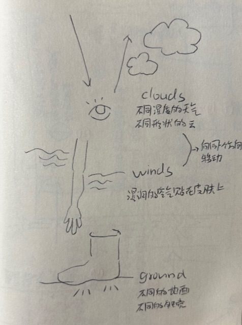
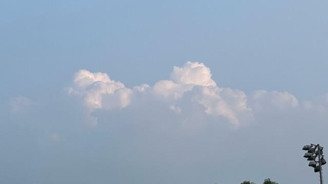

# 🔍Exploration

## ✏️Description
We explored the eco-system [in our campus](#findings-at-tongji-campus) and [Gongqing forest park](#findings-at-gongqing-forest-park) to get some inspiration of the final project.
 
click [here](#1-the-most-important-finding-which-inspired-my-final-project)( to the finding that finally became my project

## 💡Tips
- use the sense you already have and you wish you have
- think the element in the whole eco-system, think about what makes the element be there, think about the relationship, the system of input and output

## Findings at Tongji campus
### 1. Main Findings

	

- **my eyes:** 
	- the shape of the clouds will change depends on different humidity and weather
	- I found the clouds were moving slowly secretly when I lied down, which I never noticed before
  	

		
		
	

 
- **my arms:** It was a rainy day, the wind brought moisture
- **my feet:**  I felt the slight difference stepping on different surface through my shoes, I rarely pay attention to these different touches in my daily life, most of the time I choose to walk on the concrete road. I think stepping on feet is an important way for human to make connection with the nature, there is a kind of meditate is to walk barefoot, but shoes always separate us from nature.

	
	
	 
	(the soft earth after rain and the shoes with thick sole I wore that day)

### 2. Overall Exploration Map with More Findings

	
	

1. my feet felt the slight difference stepping on different surface through my shoes 
2. the lawn was just been mowed by a lawn mower and the smell of grass was strong
3. walking from the open lawn into the boulevard, the light darkened suddenly
4. the leaves on the cherry blossom avenue were bitten out of many holes by insects, and more light went through them

	
	 
	(leaves with holes)

5. several pieces of shed bark on the lawn on the rainy day

	
	 
	(shed bark on the lawn)

6. it seems that more moss appear on rainy days

	
	
	
	 
	(the moss)

7. where I lied down and noticed the clouds moving
8. the smell of the plants became stronger in the rainy days

## Findings at Gongqing Forest Park
🧐 We did our second nature exploration at Gongqing Forest Park, where is a less "urban" place compared with our campus. 
This time I got the idea for my final project! 
### 1. the most important finding which inspired my final project

	
	
	

### 2. other findings 
### 3. just wanna show you some beautiful photoes I took ;)
