# cncMilling

## Description
Time to create your own PCB! 
Design the circuit in easyEDA, cut the board with the cnc machine, and solder the components on it.

## circuit design in easyEDA

	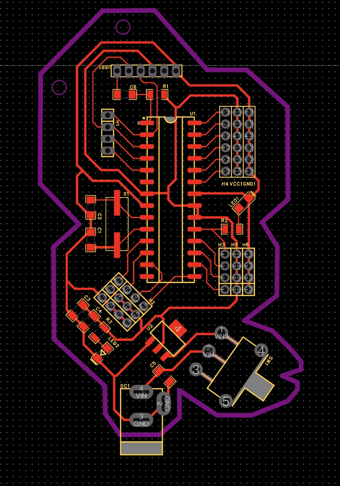

Firstly, put the components you need in the schematic, set the circuit connections between them.

	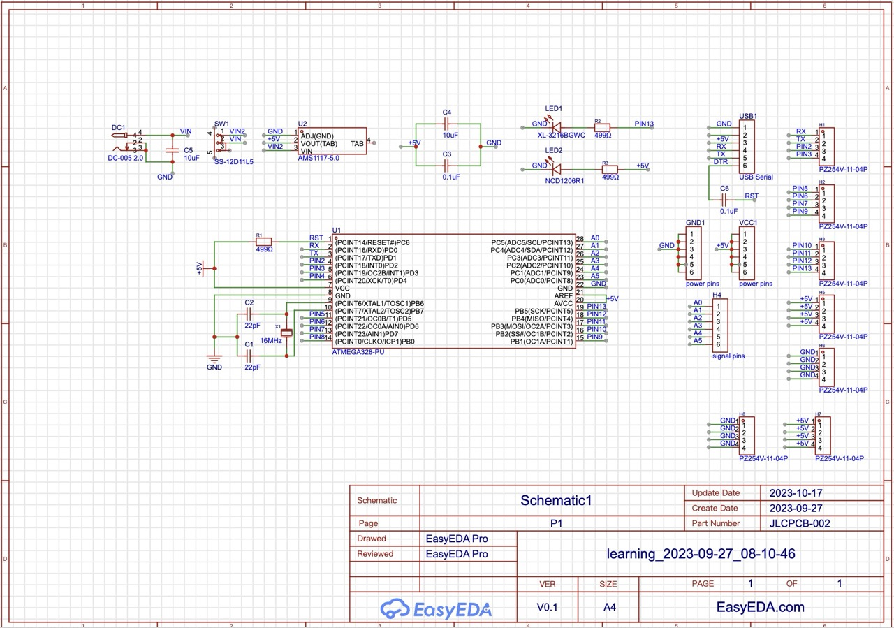

And then, in the PCB view, design the actual routing and the placement of components.  
It's a good idea to change the footprint of the components to a larger size, which will make soldering the components much easier.
 
Actually in the beginning, I wanted to create a leaf-shaped design and drew a simple sketch with only components and the outline. However, during the wiring process, I realized I had to move some components around, and the traces took up more space than I assumed. So the final shape deviated from the original design a lot.
 
It's a good idea to start with a sketch, but always keep the traces in mind when your are sketching.
 
I struggled a lot with defining the outline, trying to make it fit in the internal circuit and beautiful at the same time. I made a lot adjustments, you can see the evolving process in  the screeshots captured at different stages below.

	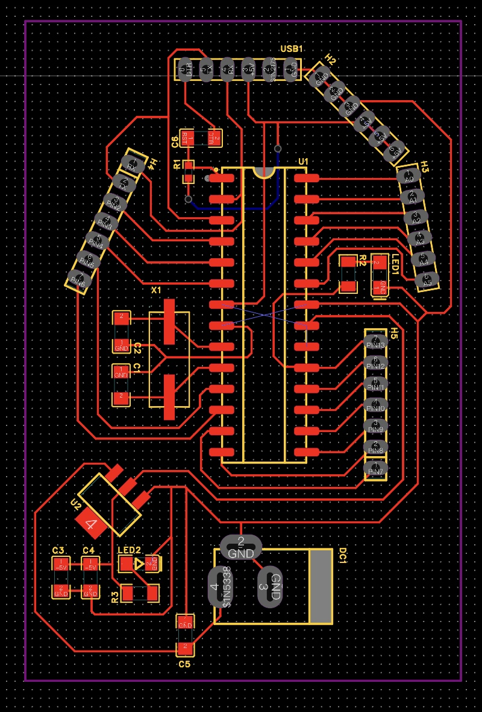
	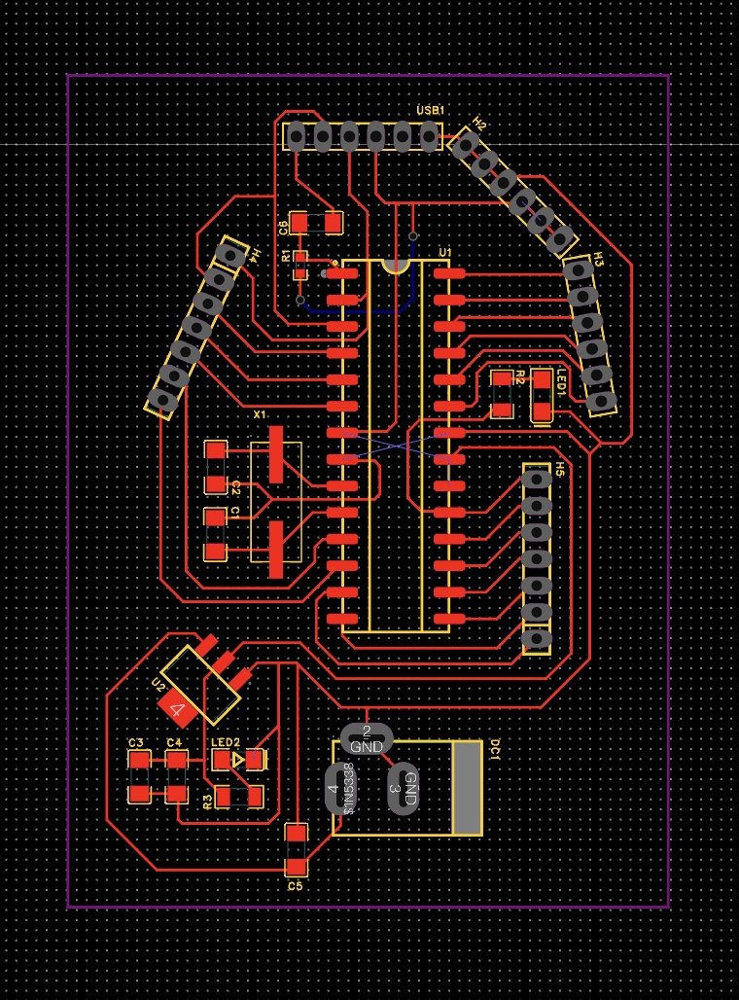
	
	

The final shape looks like a flower with a leaf. So I call it flowerino :)

## get the cut file ready
Once the design is finalized, you can't cut the board directly.  
There are additional steps required to make the design understandable for the CNC machine:
1. export a white on black pdf file in easyEDA
2. open in the pdf file in adobe illustrator or other image-processing softwares (always remember to ensure the size is correct)
3. seperate out the three cut files for traces, holes and the outline. (we will use different endmills and cutting settings)
4. export the three PNG files **at a resolution of 1000dpi**
5. upload the three PNG file to get the rml files

	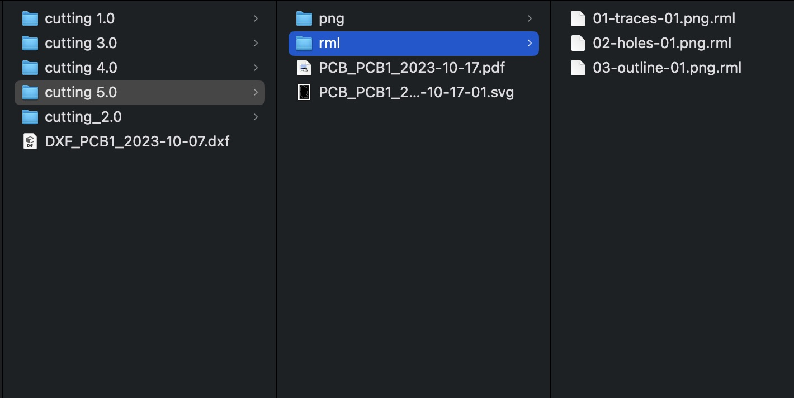

- I went through several iterations before obtaining the final cutting file that can be accurately processed. I consistently identified various oversights and issues, fortunately catching them in time before the actual cutting process. Anyway, you should have three rml files like this before you proceeding with the machine.
- One crucial point to note: ensure that the outline image does not touch the edges, or else it will not be cut properly

	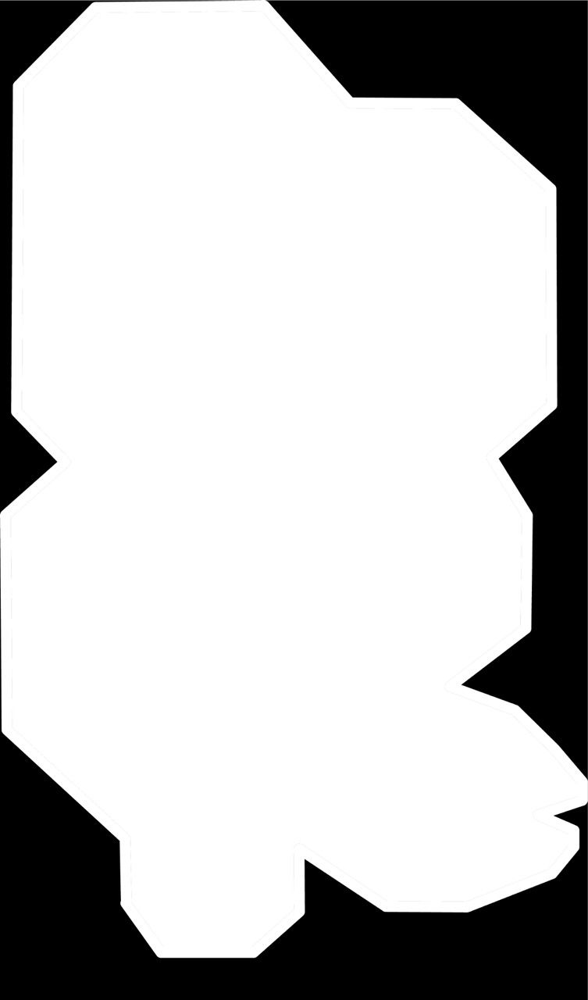
	

## cut the board with CNC machine
- steps: place the copper board securely -> calibrate the zero coordinates for the x and y axes -> install the endmill -> calibrate the zero coordinates for the z-axis

	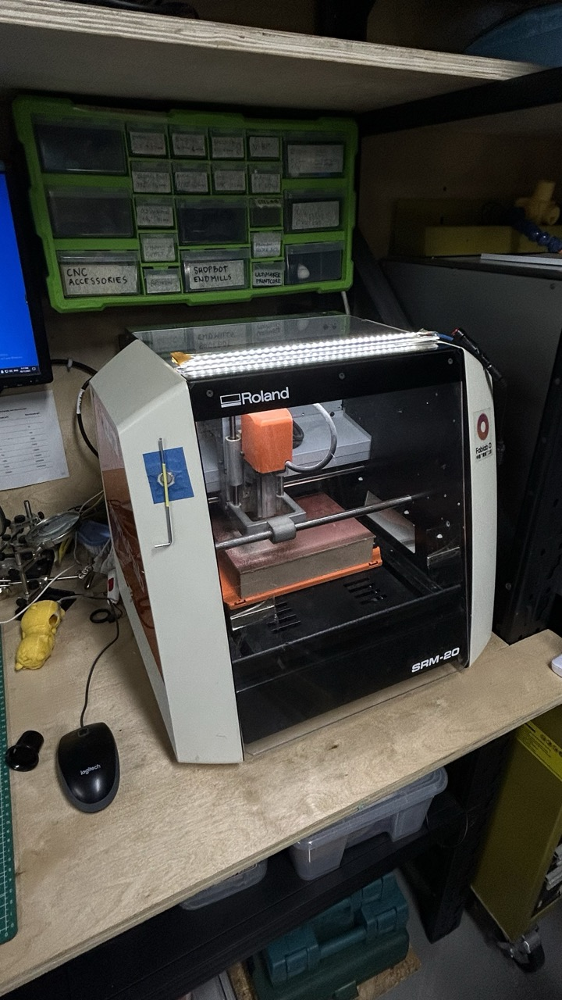
	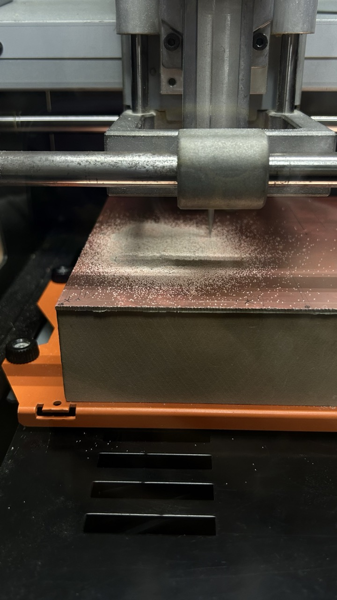

	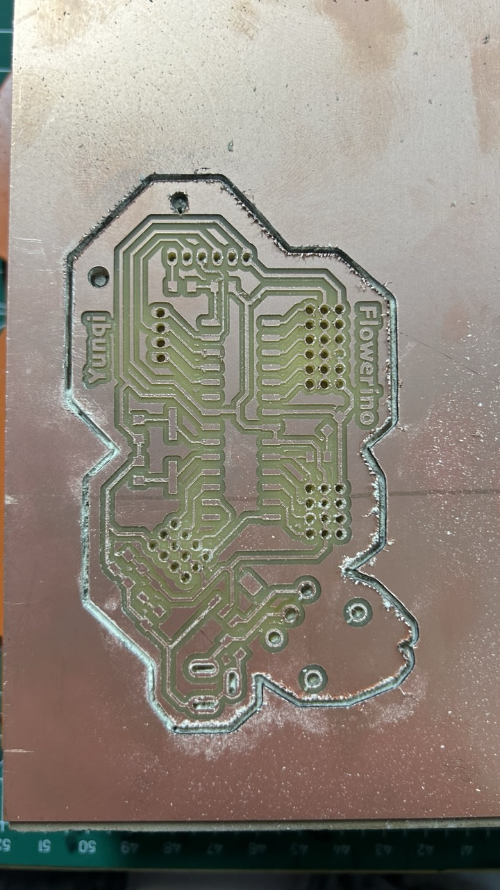
	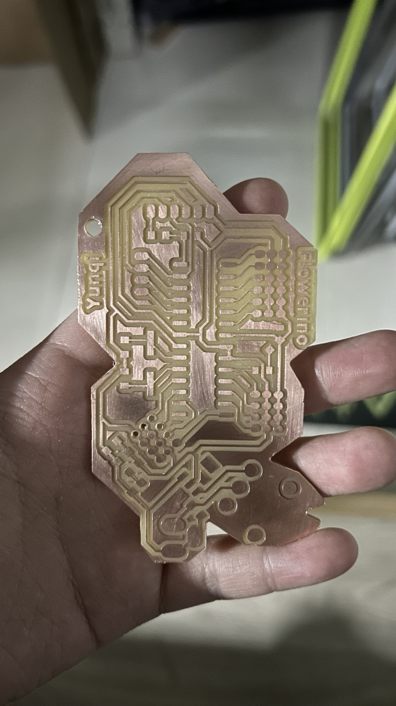

- Two ways to verify that the cutting is proceeding correctly: (Stop the machine immediately and check if you sense any abnormalities!!)
	1. Listen: A light and smooth buzzing sound.  
	2. See:  If you see dust, it indicates that the cutting is on track.
- excessive load error: The machine got stuck during the cutting process, and at this point, the coordinates are completely misaligned. To resolve this, you need to restart the machine and initiate the cutting process anew. If you remember the initial setup and zero coordinate positions, you can continue cutting directly. However, if you don't recall the zero coordinate positions, you'll need to repeat the entire cutting operation. Therefore, it's a good idea to take photos or make records to save the set XYZ zero coordinates after configuring them initially.

	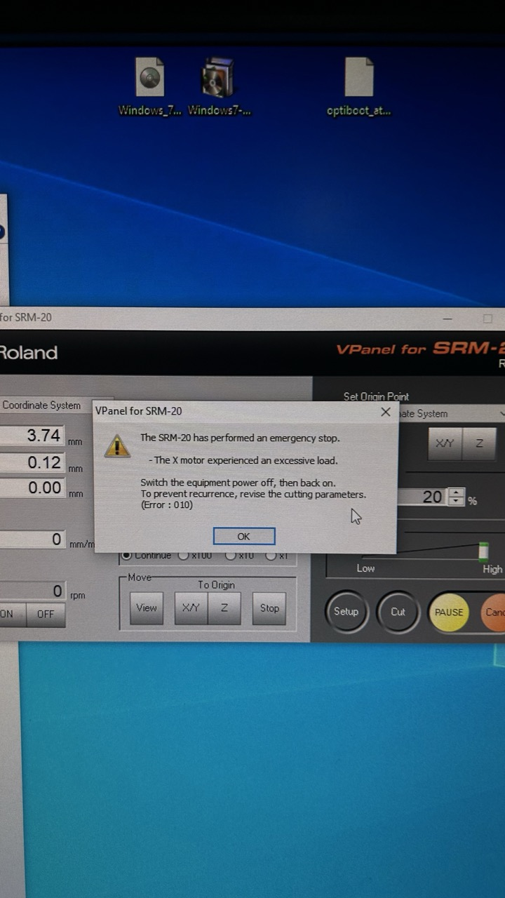
	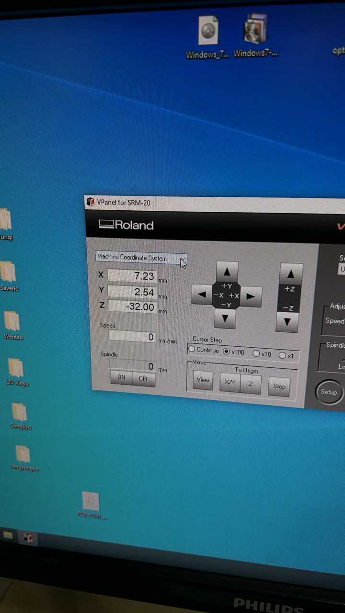

## solder components 
