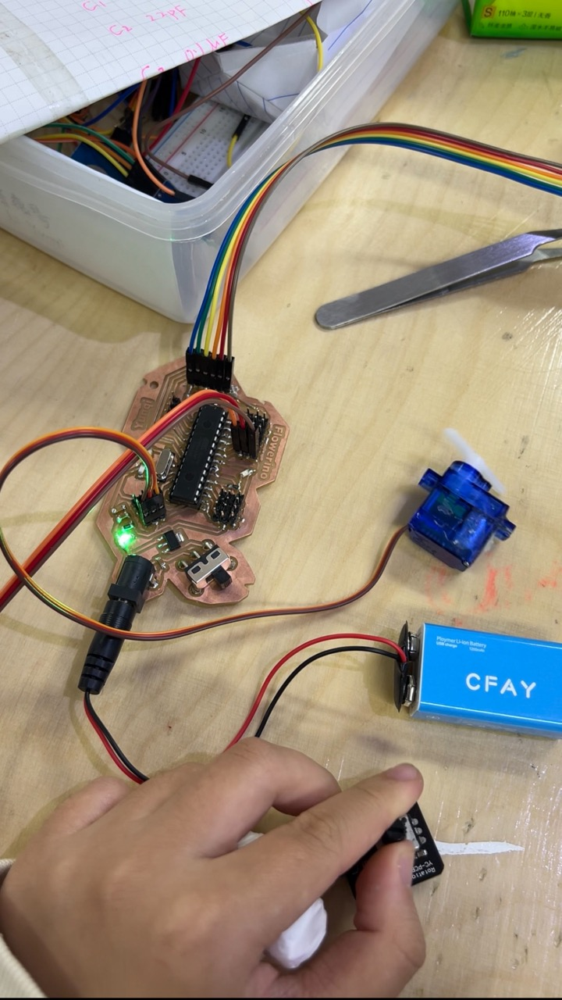

# Actuators

## Description
Sensors are INPUT devices, actuactors are OUTPUT devices. 
We use sensors to collect data, and use actuactors to translate the data we get to something humans can feel and understand. 
In this tryout, we learned about some actuators such as servo motor and I2C crystal screen. 

## Documentation
- control the servo motor with a variable resistor

	

