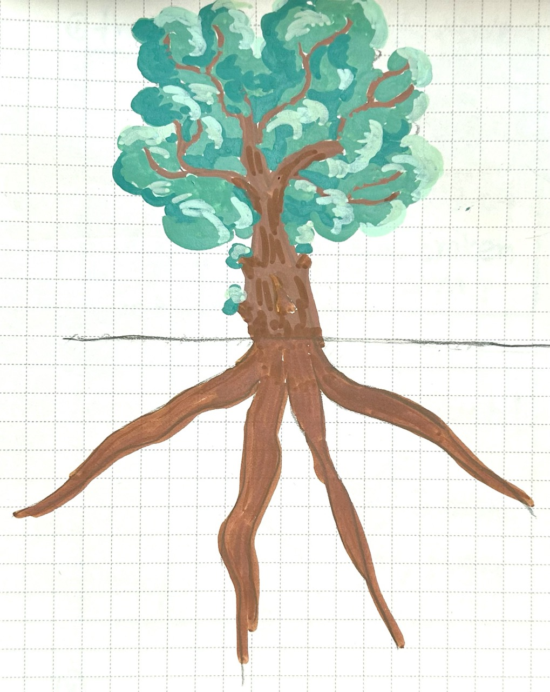
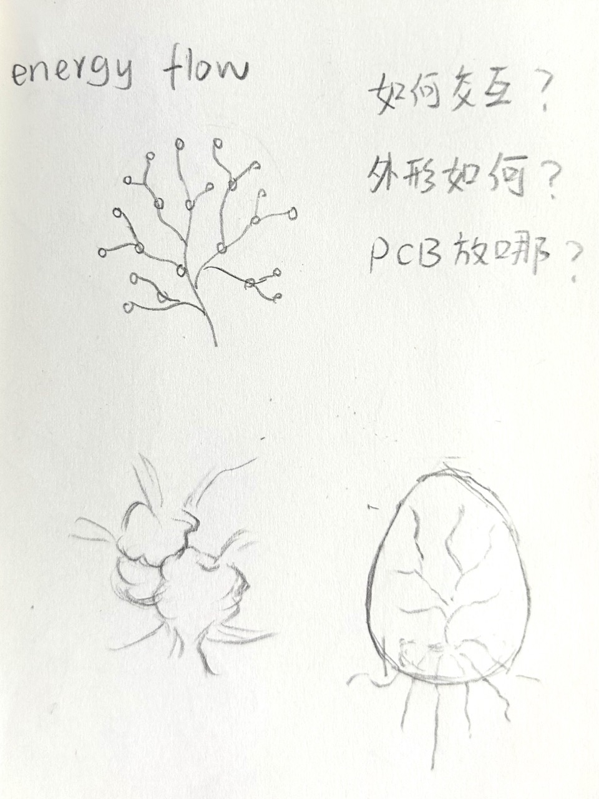
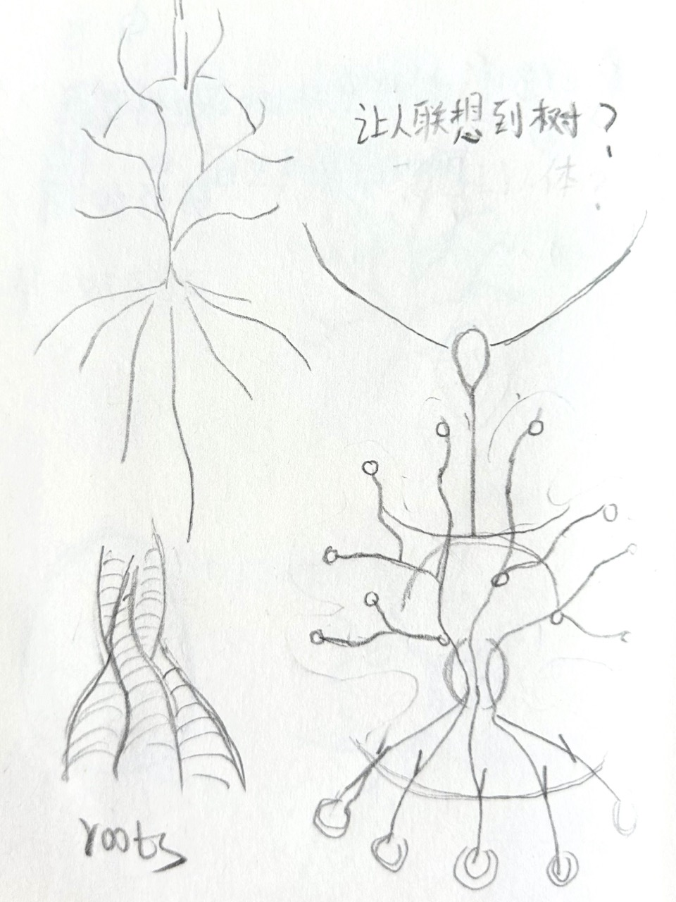
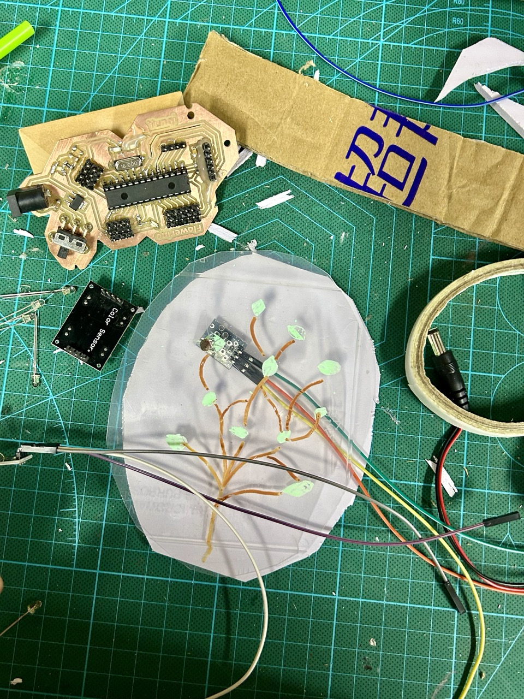
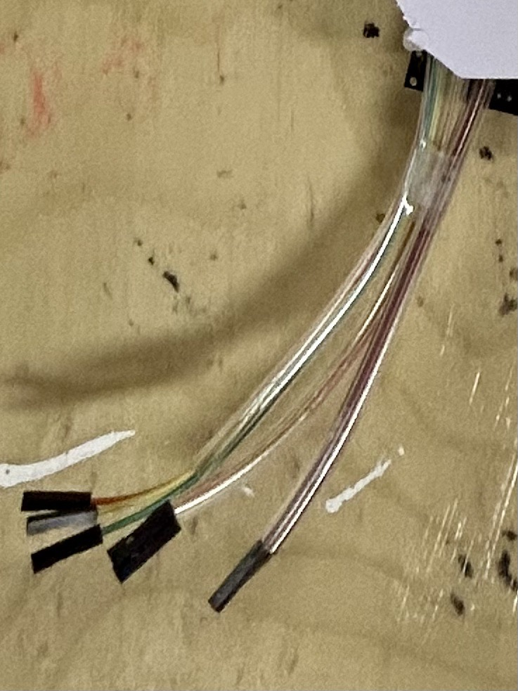
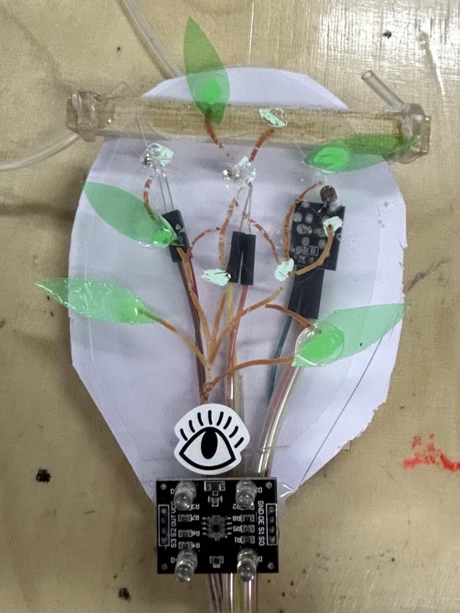
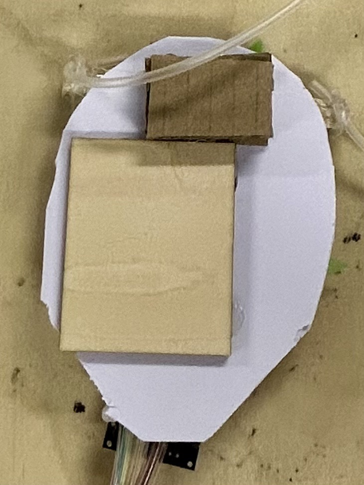
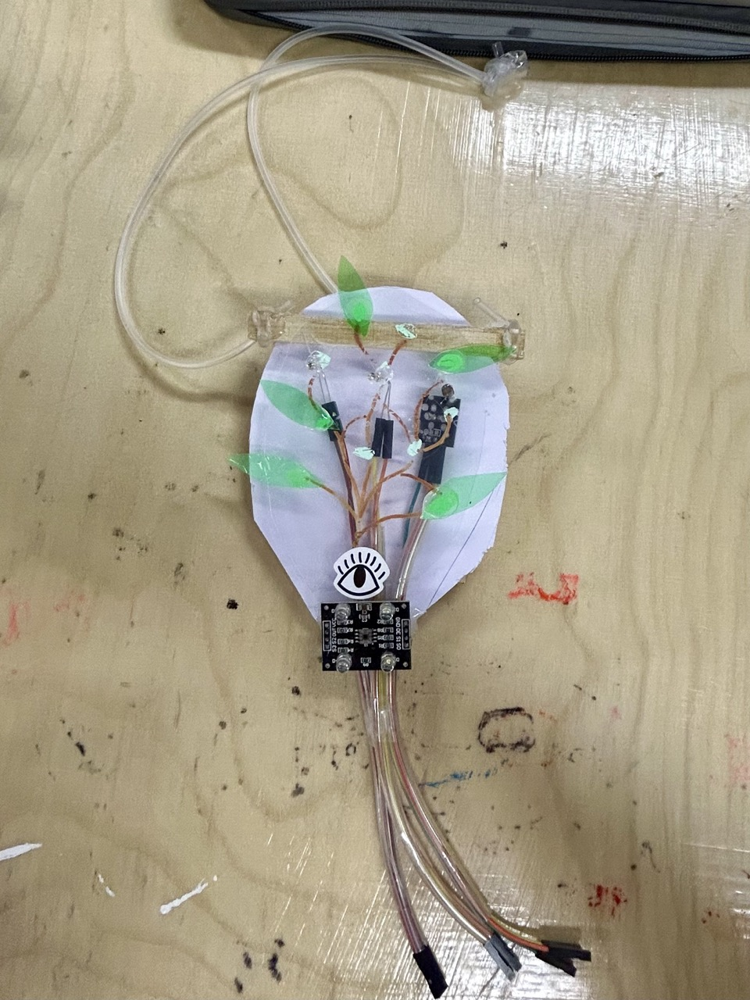
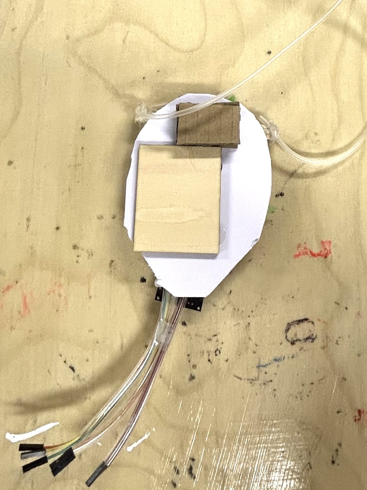
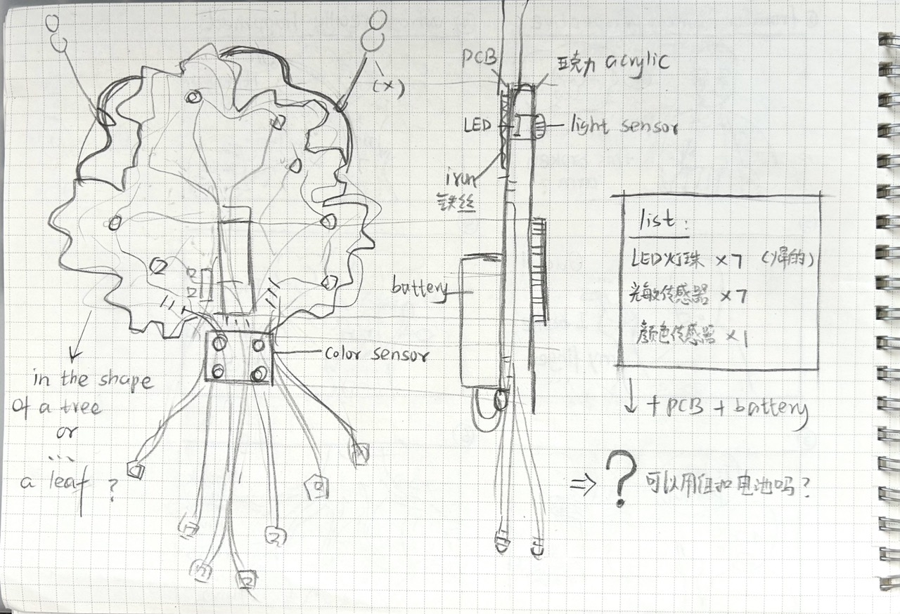

# 🛠️Prototyping

## ✏️Description & Table of Content
After getting the idea for our final project, we began creating a prototype of it, considering the physical structure of the product. 
 
-> click to check [my concept of the final project](https://github.com/Yunqi2001/TJU-PCB-2023/blob/main/04-exploration/README.md#1-idea-of-my-final-project)
 
- [My First Prototype](#my-first-prototype)
- [My Second Prototype](#my-second-prototype)
- [My Final Prototype](#my-final-prototype)

## 💡Tips
- make simple things, don't use complicate materials
- sth to make shapes + sth to cut + sth to join things together
- don't make a sketch first, let the materials to inspire you
- always change the idea, let it evolve while making
- don't use rulers or measuring tools, use the rule of thumb to save time

## My First Prototype
### 💥Let's start!
With a general [concept](https://github.com/Yunqi2001/TJU-PCB-2023/blob/main/04-exploration/README.md#1-idea-of-my-final-project) of what I wanna express in my product, I started thinking about how to physically realize it using electronic components.
   
Initially, I only had a vague notion that I could visualize the energy flow of a tree with **light**. In this setup, shining 	**LEDs** would symbolize energy, when someone conceals a LED to simulate cutting a branch, a **light sensor** positioned next to the LED would detect the change and turn off the hidden LED while making other LEDs brighter., which means the total brightness of the device will be conversed. 
 
Only when a button representing the tree's roots is pressed would serval LEDs turn off without causing the remaining LEDs to 	brighten. This imitate the tree actually losing energy when its roots are harmed.
   
At that time I didn't have a clear picture of what the device will actually look like in my mind. As I was inspired by the growth of trees, I began with imitating the shape of trees. I sketched some some trees and components. 
   
**I asked myself three questions:** 
- **1. what's the input & output devices?**
- **2. how big will it be?**
- **3. where will I place the PCB board and the battery?**

	
	
	

I only had an answer for the first question when I started creating the prototype. But it's okay, I decided to answer the 	second and the third question while working hands-on :)

### 🚧About the Structure
- After gathering some materials (rubbish, components. etc), I started with the shape of trees. The first consideration was its size. I thought it should roughly the size of a hand since I wanted hang it above my bed and also wear it around my neck like a necklace.  Given that light is a central element in the entire setup, I thought it would be nice to use some transparent material to diffuse the light, making it more visually appealing. So I firstly drew a tree shape on a piece of transparent material to confirm the general size and appearance,  and then added the circuit on it for the interactive function.
	

		
	

 
- Then let's add components to it! My idea was to create three layers: the PCB & battery layer, an opaque layer to conceal the circuit, and a transparent layer on the to scatter 	the light. And put the LEDs and light sensors on the top through the holes on the layers. (Unfortunately I cut my finger when trying to make holes with a knife. Always 	remember to use drills to make holes😢)
	   
	Luckily I found a oxygen tube! I cut it and wrapped the jump wires with it, which enhanced the overall appearance.
	   
	I got a new inspiration when gathering materials! I wanted to add a new feature for "recharging" the "tree" when all the "roots "are harmed and all the "energy"  of the 	"tree" is depleted. The color sensor provided me with an idea.  I placed a color sensor at the base of the "tree" as a new input interface. When all the LEDs are off, 		indicating that all the energy of the "tree" has been depleted, people can put the device near something green to "recharge" it. Then all the LEDs will turn on again,  and 	people can interact with it once more.
	   
	Actually I should connect it to the PCB board I made earlier and the battery. But I found that the board I had created was a little bit large for the size of product I 	wanted to make. So I cut a wooden board to replace the actual PCB and I used a paper board as a substitute for the battery. This prototype won't really work.
	

		
		
		
	

- After having the main structure, some decorations and accessories for hanging were added.  This prototype is now complete.
  

	
	
  

### 🤔Reflection & ideas about evolution

	

## My Second Prototype

## My Final Prototype
