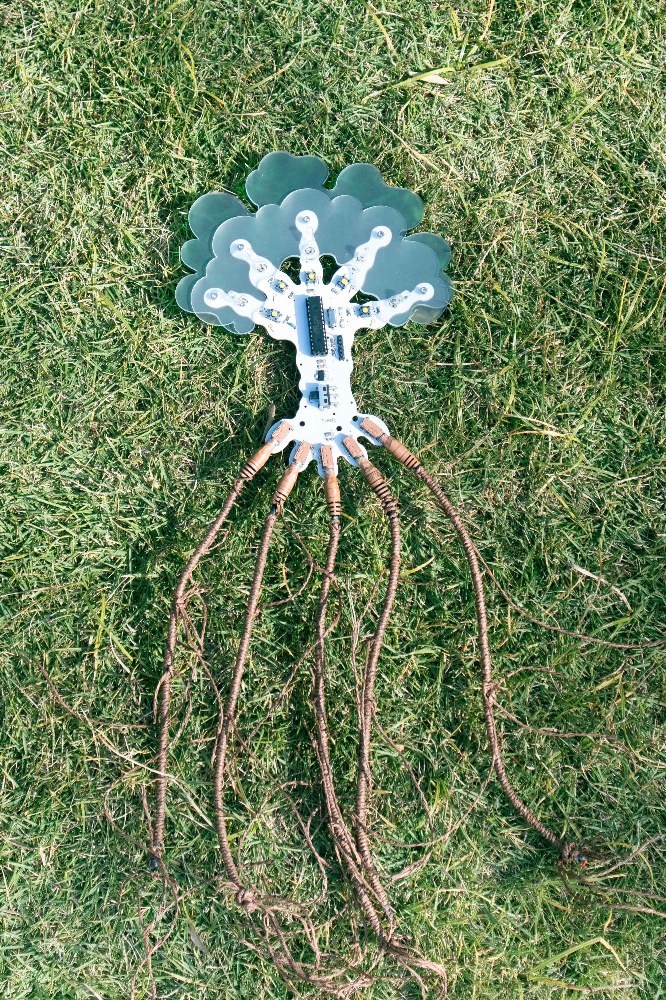

# Final project: Life Rhythm 生之律

## Description
How do humans perceive plants?

At times, we project ourselves into them. The broken branches of trees evoke thoughts of human limbs, yet for humans, body losses is irreversible. But for a tree, losing a branch is quite normal. The energy from the lost limb is redirected to other branches, and only when the roots underground are harmed does the tree actually lose its energy.

That's the life rhythm of trees. As humans, there is no need to overly imbue this with emotion and personal experiences. Just pause and feel!

人如何感知植物？有的时候人们代入自身。

树的断枝让人联想到人类残缺的肢体，对人类来说躯体的残缺是不可逆的，但对树来说是一种非常平常的事，损失掉断肢，就把能量给其他的枝干，只有藏在地下的根部受到伤害，才真正损失了它的能量。

这是树的生之律，作为人类我们并不需要过多地投射情感和经验，只是停下来，感受。

<br/>
-> click to check [how I got the inspiration of final project](https://github.com/Yunqi2001/TJU-PCB-2023/blob/main/04-exploration/README.md#1-idea-of-my-final-project)
<br/>

<p align="center">
	
</p>

## overview
[click to download my presentation video](https://github.com/Yunqi2001/TJU-PCB-2023/blob/main/08-finalproject/final_video.mp4)
<p align="center">
	
	
</p>
<p align="center">
	
	
	
	
</p>

## circuit design
[click to view my JLC page](https://u.easyeda.com/join?type=project&key=1d0ad0fddd464573b1f5d1b4cbe1dce2&inviter=c1b5e9f0ba0b4472a1211fd8100dc0da)
<p align="center">
	
</p>

## code
```
int initialBrightness = 10;
int howManyBranches = 5;
int howManyCut = 0;
int shareBrightness;

class Branch{
  private:
    int ledPin;
    int buttonPin;
    int currentBrightness; //the brightness of this branch now

  public:
    Branch(int pin, int button){ //initialize the branch
    ledPin = pin;
    buttonPin = button;
    currentBrightness = initialBrightness;

    pinMode(buttonPin,INPUT);
    pinMode(ledPin,OUTPUT);
    analogWrite(ledPin, initialBrightness);

    }

    int getButton(){
      return buttonPin;
    }

    void cut(){
      digitalWrite(ledPin,LOW); //turn off the cut branch
      currentBrightness = 0;
      howManyCut += 1;
      shareBrightness = howManyCut * initialBrightness*10;
    }

    void recover(){
      Serial.println("recover");
      while (currentBrightness < initialBrightness) {
        currentBrightness++;
        analogWrite(ledPin, currentBrightness);
        delay(10);  
      }
    
      howManyCut -= 1;
    }

    void receive_Energy(){
      while (currentBrightness < initialBrightness + shareBrightness) {
        currentBrightness++;
        analogWrite(ledPin, currentBrightness);
        delay(10);  
      }
    }

    void release_Energy(){
      Serial.println("release");
      while (currentBrightness > initialBrightness) {
        currentBrightness--;
        analogWrite(ledPin, currentBrightness);
        delay(10);  
      }
    }

};

Branch branch[] = {
  Branch(5, 7),
  Branch(6, 8),
  Branch(9, 13),
  Branch(10, 12),
  Branch(11, 4)
};

int button1 = branch[0].getButton();
int button2 = branch[1].getButton();
int button3 = branch[2].getButton();
int button4 = branch[3].getButton();
int button5 = branch[4].getButton();

int j1 = 0;
int j2 = 0;
int j3 = 0;
int j4 = 0;
int j5 = 0;

int isCut1 = false;
int isCut2 = false;
int isCut3 = false;
int isCut4 = false;
int isCut5 = false;

unsigned long lastCutTime1 = 0;
unsigned long lastCutTime2 = 0;
unsigned long lastCutTime3 = 0;
unsigned long lastCutTime4 = 0;
unsigned long lastCutTime5 = 0;

int recoverInterval = 7000;

void setup() {
  Serial.begin(9600);
}

void loop() {
 //branch1
  if(digitalRead(button1) == HIGH){
    branch[0].cut();
    isCut1 = true;
    lastCutTime1 = millis();
    Serial.println("branch1 is cut now");

    j1=random(5); 
    while(j1 == 0){
      j1=random(5);
    }
    Serial.println(j1);
    branch[j1].receive_Energy();
  }

  if(isCut1){
    if(millis() - lastCutTime1 == recoverInterval){
      branch[j1].release_Energy();
      branch[0].recover();
      isCut1 = false;
      Serial.println("finish");
    }
  }


  //branch2
  if(digitalRead(button2) == HIGH){
    branch[1].cut();
    isCut2 = true;
    lastCutTime2 = millis();
    Serial.println("branch2 is cut now");

    j2=random(5); 
    while(j2 == 1){
      j2=random(5);
    }
    Serial.println(j2);
    branch[j2].receive_Energy();
  }

  if(isCut2){
    if(millis() - lastCutTime2 == recoverInterval){
      branch[j2].release_Energy();
      branch[1].recover();
      isCut2 = false;
      Serial.println("finish");
    }
  }


  //branch3
  if(digitalRead(button3) == HIGH){
    branch[2].cut();
    isCut3 = true;
    lastCutTime3 = millis();
    Serial.println("branch3 is cut now");

    j3=random(5); 
    while(j3 == 2){
      j3=random(5);
    }
    Serial.println(j3);
    branch[j3].receive_Energy();
  }

  if(isCut3){
    if(millis() - lastCutTime3 == recoverInterval){
      branch[j3].release_Energy();
      branch[2].recover();
      isCut3 = false;
      Serial.println("finish");
    }
  }
    

  //branch4
  if(digitalRead(button4) == HIGH){
    branch[3].cut();
    isCut4 = true;
    lastCutTime4 = millis();
    Serial.println("branch4 is cut now");

    j4=random(5); 
    while(j4 == 3){
      j4=random(5);
    }
    Serial.println(j4);
    branch[j4].receive_Energy();
  }

  if(isCut4){
    if(millis() - lastCutTime4 == recoverInterval){
      branch[j4].release_Energy();
      branch[3].recover();
      isCut4 = false;
      Serial.println("finish");
    } 
  }


  //branch5
  if(digitalRead(button5) == HIGH){
    branch[4].cut();
    isCut5 = true;
    lastCutTime5 = millis();
    Serial.println("branch5 is cut now");

    j5=random(5); 
    while(j5 == 4){
      j5=random(5);
    }
    Serial.println(j5);
    branch[j5].receive_Energy();
  }

  if(isCut5){
    if(millis() - lastCutTime5 == recoverInterval){
      branch[j5].release_Energy();
      branch[4].recover();
      isCut5 = false;
      Serial.println("finish");
    } 
  }

}
```
